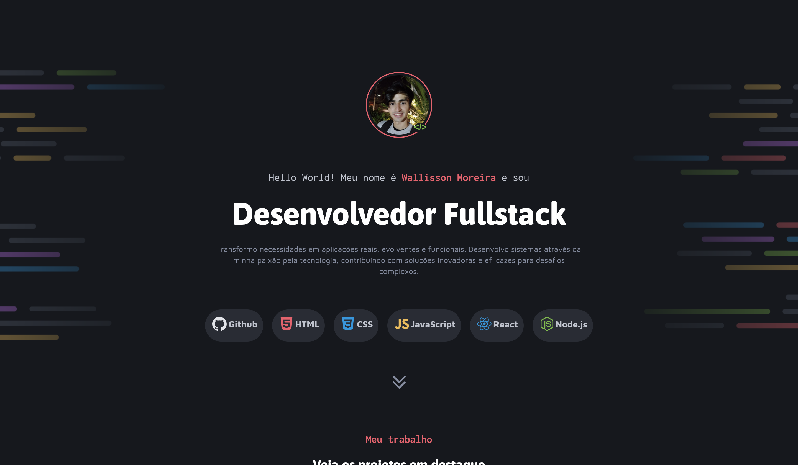
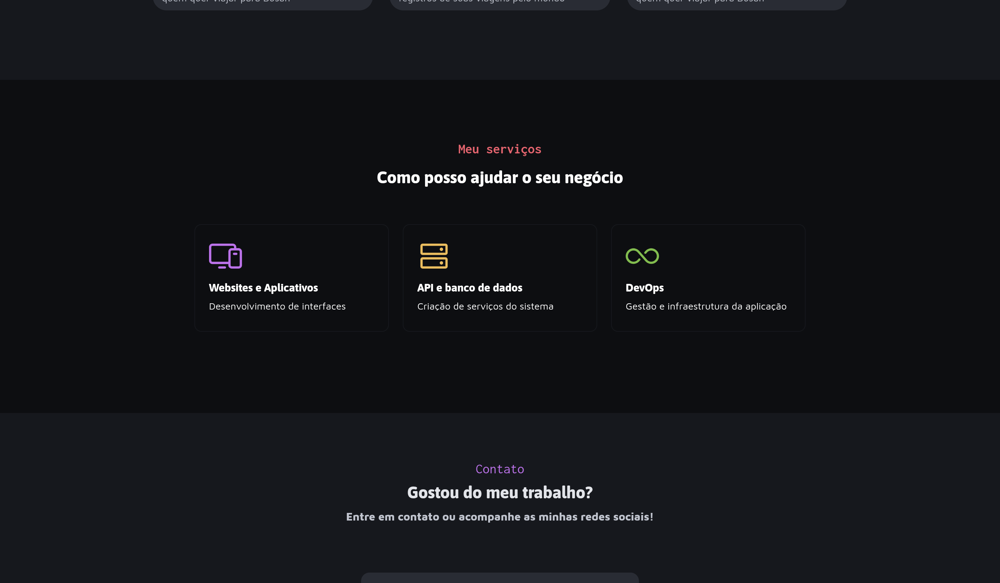
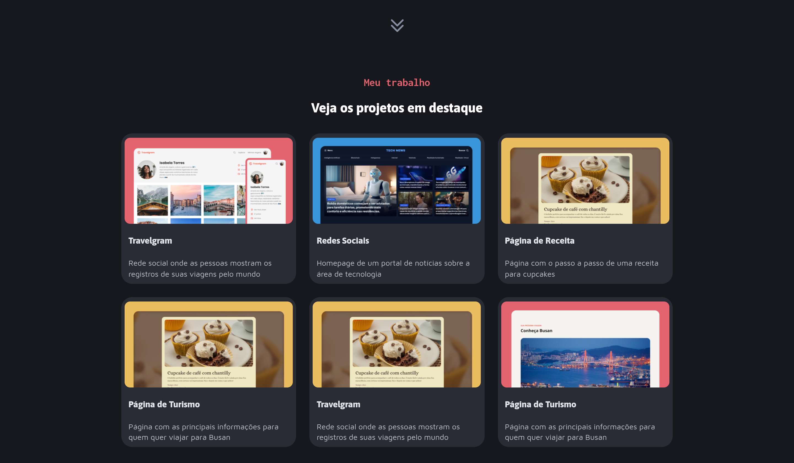

# 🌐 Portfólio Dev

> Um portfólio criado durante meu percurso Fullstack na Rocketseat


---

## 📋 Sobre o Projeto

Portfólio voltado a apresentar quais tecnologias tenho conhecimento e quais serviços sou capacitado a prestar, procurando extrair o máximo de HTML e CSS.

---

## ✨ Funcionalidades

- ✅ Paleta de cores consistente com variáveis CSS
- ✅ Tipografia hierárquica e legível
- ✅ Redirecionamento às mídias sociais

---

## 🖼️ Preview

| Intro | Serviços | Projetos |
|-------|----------|----------|
|  |  |  |

---

## 🛠️ Tecnologias Utilizadas

| Tecnologia | Finalidade |
|------------|------------|
| HTML5 | Estrutura semântica das páginas |
| CSS3 | Estilização, Flexbox/Grid e responsividade |

---

## 📁 Estrutura de Pastas

```
📦 portfolio-dev-rockseat
├── 📄 index.html
├── 📁 styles/
│   ├── footer.css
│   ├── intro.css
│   ├── projects.css
│   ├── services.css
│   ├── style.css
│   └── utility.css
├── 📁 assets/
│   └── 📁 images/
└── 📄 README.md
```

---

## 🚀 Como Visualizar o Projeto

1. Clone o repositório:
```bash
git clone https://github.com/WallissonDev/portfolio-dev-rockseat.git
```

2. Acesse a pasta do projeto:
```bash
cd portfolio-dev-rockseat
```

3. Abra o arquivo `index.html` no navegador.

> Ou acesse diretamente pelo **[GitHub Pages →](https://wallissondev.github.io/portfolio-dev-rocketseat/)**

---

## 📚 Aprendizados

- Uso de **CSS Grid** e **Flexbox** para layouts mais complexos
- Organização de estilos com **variáveis CSS**
- Boas práticas de **HTML semântico**

---

## 👤 Autor

**Wallisson Moreira de Lima**

[](https://github.com/WallissonDev)

---

*Feito com 💙 e muito CSS.*
